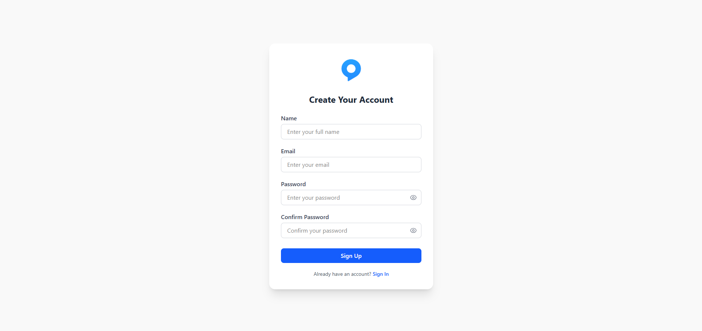
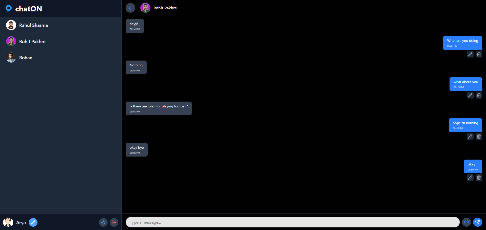

# 💬 chatON - Real-Time Chat Application

> A modern and scalable **Real-Time Chat Application** built with React, Vite, Redux Toolkit, and Firebase. Designed for seamless one-on-one messaging, real-time updates, and a responsive user experience.

---

## Status

[](https://reactjs.org)
[](https://vitejs.dev)
[](https://redux-toolkit.js.org)
[](https://firebase.google.com)
[](https://pnpm.io)
[](https://tailwindcss.com)
[](https://lucide.dev)

---

## 📖 About chatON

**chatON** is a modern, lightweight, and feature-rich **Real-Time Chat Application** designed to facilitate seamless one-on-one communication. Built with **React**, **Vite**, and **Redux Toolkit**, and powered by **Firebase** for authentication and real-time data synchronization, chatON offers a robust platform for users to connect, chat, and manage their profiles in real time.

The application supports **full CRUD operations** for messages and user profiles, with features like real-time messaging, user search, and online status indicators. Its **responsive design** and **light/dark theme support** ensure an engaging user experience across devices. The app leverages **Firebase Firestore** for real-time data updates and **Redux Toolkit** for efficient state management, making it scalable and maintainable.

---

## 📸 Sneak Peek

### Sign-Up Page



### Home Page



## 🎥 App Showcase


---

## 🚀 Features

- **Real-Time Messaging**: Send, edit, and delete messages with instant updates via Firebase Firestore.
- **User Authentication**: Secure sign-up, sign-in, and logout with Firebase Authentication.
- **Profile Management**: Update user display names and profile photos, synced to Firestore.
- **Searchable User List**: Find users by display name to initiate chats.
- **One-on-One Chats**: Private chat rooms with automatic chat ID generation for secure messaging.
- **Message Actions**: Edit or delete sent messages with visual indicators for edited messages.
- **Online Status**: Real-time "last seen" and online/offline indicators using Firestore timestamps.
- **Theme Toggle**: Switch between light and dark modes with smooth transitions.
- **Emoji Support**: Integrated emoji picker for expressive messaging.
- **Responsive Design**: Mobile-friendly UI optimized with Tailwind CSS.
- **Global State Management**: Efficient state handling with Redux Toolkit for users and chats.
- **Error Handling**: User-friendly error messages for authentication, messaging, and profile updates.
- **Performance-Optimized**: Fast builds and development with Vite and pnpm.
---

## 🛠 Tech Stack

- **Frontend**: React 18.2.0, Vite 5.2.0
- **State Management**: Redux Toolkit 1.9.5
- **Backend**: Firebase 9.23.0 (Authentication, Firestore)
- **Package Manager**: pnpm 8.6.0
- **Styling**: Tailwind CSS 3.3.2
- **Icons**: Lucide React 0.252.0
- **Routing**: React Router DOM 6.11.0
- **Linting & Formatting**: ESLint, Prettier
---

## 📂 Project Structure

```
chatON/
├── public/                 # Static assets (e.g., favicon, images)
├── src/
│   ├── assets/             # Images, logos, and other static files
│   ├── components/         # Reusable UI components (e.g., UserList, ChatSection)
│   ├── contexts/           # React Context for theme management
│   ├── modules/            # Redux slices (e.g., userSlice.js, chatSlice.js)
│   ├── pages/              # Page components (e.g., SignUp, SignIn)
│   ├── firebase.js         # Firebase configuration and initialization
│   ├── App.jsx             # Root component with routing
│   ├── index.css           # Global styles with Tailwind CSS
│   └── main.jsx            # Application entry point
├── .gitignore
├── eslint.config.js        # ESLint configuration
├── index.html              # HTML entry point
├── LICENSE                 # MIT License file
├── package.json            # Project metadata and dependencies
├── pnpm-lock.yaml          # pnpm lock file
├── pnpm-workspace.yaml     # pnpm workspace configuration
└── vite.config.js          # Vite configuration
```

---

## 🛠️ Installation & Setup

### 1\. Clone the Repository

```
git clone https://github.com/your-username/chatON.git
cd chatON
```

### 2\. Install Dependencies

```
pnpm install
```

### 3\. Set Up Firebase

1.  Create a Firebase project in the Firebase Console.
2.  Enable **Authentication** (Email/Password provider) and **Firestore Database**.
3.  Copy your Firebase configuration and update src/firebase.js:

    ```
    import { initializeApp } from "firebase/app";
    import { getAuth } from "firebase/auth";
    import { getFirestore } from "firebase/firestore";

    const firebaseConfig = {
        apiKey: "your-api-key",
        authDomain: "your-auth-domain",
        projectId: "your-project-id",
        storageBucket: "your-storage-bucket",
        messagingSenderId: "your-messaging-sender-id",
        appId: "your-app-id"
    };

    const app = initializeApp(firebaseConfig);
    export const auth = getAuth(app);
    export const db = getFirestore(app);
    ```

4.  Configure Firestore security rules in the Firebase Console:

    ```
    rules_version = '2';
    service cloud.firestore {
        match /databases/{database}/documents {
            match /users/{userId} {
                allow read: if request.auth != null;
                allow write: if request.auth.uid == userId;
            }
            match /userStatus/{userId} {
                allow read: if request.auth != null;
                allow write: if request.auth.uid == userId;
            }
            match /chats/{chatId}/messages/{messageId} {
                allow read, write: if request.auth != null;
            }
        }
    }
    ```

### 4\. Run the Development Server

```
pnpm dev
```

### 5\. Building for Production

```
pnpm build
```

---

## 📚 Usage

### 🔑 Access the Application

- Open http://localhost:5173 in your browser after running the development server.
- **Sign Up** or **Sign In** using email and password.
- Browse the user list, select a user, and start chatting in real time.

### 🛠️ User Features

- **Sign Up/Sign In**: Create an account or log in with Firebase Authentication.
- **Chat**: Send, edit, or delete messages in private one-on-one chat rooms.
- **Profile**: Update your display name and profile photo.
- **Search**: Find users by display name to initiate chats.
- **Theme Toggle**: Switch between light and dark modes.

---

## 🛠️ Development Guidelines

### 📝 Code Style

- Use **ESLint** and **Prettier** for consistent code formatting.
- Follow the provided ESLint configuration (eslint.config.js).
- Organize components and logic by feature in src/modules and src/components.

### 🤝 Contributing

1.  **Fork** the repository.
2.  Create a new branch:

    ```
    git checkout -b feature/your-feature-name
    ```

3.  Commit your changes:

    ```
    git commit -m "Add your feature description"
    ```

4.  Push to your branch:

    ```
    git push origin feature/your-feature-name
    ```

5.  Open a Pull Request.

### 🛠️ Debugging Tips

- **Firebase Errors**: Check the Firebase Console for authentication or Firestore issues.
- **Redux State**: Use Redux DevTools to inspect state changes.
- **Console Logs**: Enable logging in chatSlice.js and ChatSection.jsx to trace message or listener issues.

---

## 👥 Contributors

We are grateful to the following contributors who have helped shape **chatON**:
- **Rohit Pakhre** -- Lead Developer
